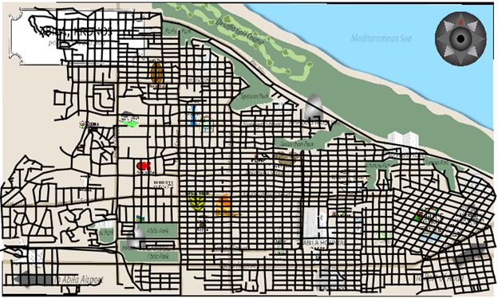
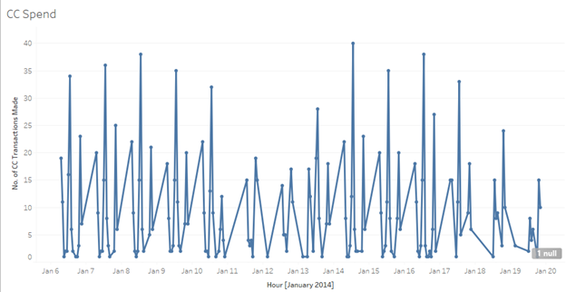
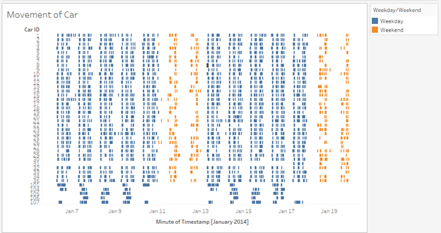

```{r setup, include=FALSE}
knitr::opts_chunk$set(echo = FALSE)
```

# Introduction

The goal of the annual Institute of Electrical and Electronics Engineers (IEEE) Visual Analytics Science and Technology (VAST) Challenge is to advance the field of visual analytics through competition. The 2021 IEEE VAST Challenge brings back a classic challenge from 2014 to see how approaches and techniques have developed since the original release of the challenge.  
The background of the challenge is as below:  

In the roughly twenty years that Tethys-based GAStech has been operating a natural gas production site in the island country of Kronos, it has produced remarkable profits and developed strong relationships with the government of Kronos. However, GAStech has not been as successful in demonstrating environmental stewardship.  

In January, 2014, the leaders of GAStech are celebrating their new-found fortune as a result of the initial public offering of their very successful company. In the midst of this celebration, several employees of GAStech go missing. An organization known as the Protectors of Kronos (POK) is suspected in the disappearance, but things may not be what they seem.  

# Objective 

This project aims to understand better the individuals and organizations that are involved in this situation. We do this by exploring and doing the following: 

* Obtaining a more holistic profile of employees
  + Understanding what the daily routines and characteristics of the employees are like. 
  + Exploring if there is a difference between their weekday and weekend routines? Are their daily routines dependent on their employment type?
  + Identifying defining characteristics of individuals/organization, like how many coffees this person drink a day, how many times does this person appear in news articles, what are each person's expenditure etc 
  + Identifying any anomalous or suspicious behavior.
* Identifying formal (work-related) or informal (non-work related e.g., playing golf together during the weekends) relationships.
  + Discover different ways of grouping/segmenting the employees.
  + Discover any associations based on common interest given in the data. 
  + Are there any relationships between CC expenditure + GPS [MC2] and events we can extract from News articles [MC1]

We will do so by delivering an R-Shiny app that provides:  

1. Interactive user interface design
2. Exploratory functionality that allows user to interact with the data and gain insights. 
3. Visualize individual/organization profiles and relationships between them. 


# Datasets 

We'll be using data sets from Mini-Challenge 1 [MC1] and Mini-Challenge 2 [MC2]. 

From [MC1], we will be transforming the non-structured data in form of news articles into structured data via text analytics and then extract attributes per individual. 

From [MC2], we will be extracting insights based on credit card transactions and geographical data. 

We will also be joining the two data sets based on individuals to analyzing attributes by features across data sets. 


# Scope and Methodology

Our scope and methodology is as below:  

1. Data preparation using dplyr and other r packages 	
2. Analysis of VAST 21 data set with background research using some of the following methods:  
    + Exploratory Data Analysis (EDA) methods in R
    + Exploratory Spatial Data Analysis (ESDA) methods in R
    + Clustering methods for aspatial and geospatial information in R
    + Text analysis in R
    + Network Analysis in R
3. Creating a R shiny dashboard showing our findings/insights and conclusions: 
    + R Markdown development for functionality checks
    + R-Shiny app development for user interactivity

# First look

* Map of Abila, Kronos

 
 * Trend of credit card transactions over time - The number of credit card transactions peak at 1pm and 8pm on a daily basis.
 


* Movement of Cars & Trucks - We see that there is no movement of trucks over the weekends.

