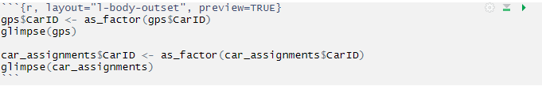
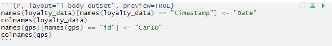
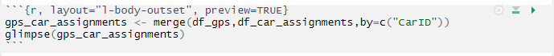
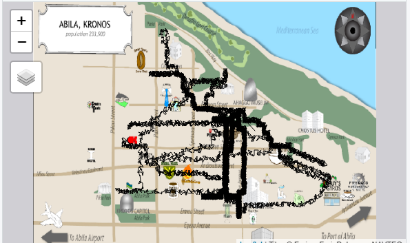

```{r setup, include=FALSE}
knitr::opts_chunk$set(echo = FALSE)
```

# 1. Introduction

Mini-Challenge 2 (MC2) is one of the 3 challenges from the VAST 2021 Challenge. An interesting note is that the VAST 2021 Challenge is actually adapted from the VAST 2014 Challenge. 

For our chosen challenge, MC2, the main objective is to use the given data to discover unusual patterns in employees’ daily lives from their credit/debit/loyalty card records and the GPS tracking records of their cars.  

# 2. Literature Review

We conduct a review of how the analysis was conducted previously for the VAST 2014 challenge. In particular, we looked at analyses conducted by a team from Peking University (PKU) [(Chen, 2014)](http://simingchen.me/docs/vastchallenge14-mc2.pdf) and the team from the University of Konstanz (UoK) [(Fischer, 2014)](http://vis.cs.ucdavis.edu/vis2014papers/VIS_Conference/vast/challenge/Fischer_02.pdf). The approach that both teams took involved the cross analysis and merging of all the data files.

The team from PKU proposed a multi-filter visual analytics web-based system for movement data investigation called Movement Finder. Their system integrates movement information from different datasets. With various visualizations and multiple filters, it is able to summarize the general movement patterns of a group of people, and help analysts detect abnormal events. 


The team assumed some definitions when building this application - they defined all stops above 1 minute in the GPS data as events and they defined some Point-of-Interests(POIs) and transaction information by categorising the different locations present from the tourist map. If a car's GPS data indicated that the car's location was within the boundary of a POI, it would be assumed that car was at the particular POI.  

On the other hand, the team from UoK presented a Geographic Information System (GIS) aimed to interactively analyze the complex geo-temporal data of MC2. A time series indicates the amount of movement over time that guides the user to interesting time frames. Further, suspects and location types can be interactively filtered to discover unexpected behaviour patterns.  

# 3. Data Preparation

### 3.1 Loading the Datasets  

Import relevant packages into R. The R packages will be used to read the data and plot the visualization.


```{r, layout="l-body-outset", preview=TRUE}
packages = c('tmap','clock','wesanderson','DT', 'ggiraph', 'plotly', 'shiny', 'tidyverse', 'dplyr','tibbletime', 'lubridate', 'rgdal', 'readr', 'sf', 'raster')

for(p in packages){
  if(!require(p, character.only = T)){    
    install.packages(p)  
  }  
  library(p, character.only = T)
}
```


### 3.2 Data Wrangling

Firstly, we import all the necessary datasets.


```{r, layout="l-body-outset", preview=TRUE}
cc_data <- read_csv("cc_data.csv")
glimpse(cc_data)
loyalty_data <- read_csv("loyalty_data.csv")
glimpse(loyalty_data)
car_assignments <- read_csv("car-assignments.csv")
glimpse(car_assignments)
gps <- read_csv("gps.csv") 
glimpse(gps)
```

We note that the timestamp fields is not in date-time format and also, the ID field should be in factor data type.

Before we proceed, we want to transform the values in timestamp field into correct date-time format, deriving a day-of-month field from timestamp and deriving a hour-of-day field from timestamp. Specifically, for the cc dataset, we want to transform values in last4ccnum field to character data type.


```{r, layout="l-body-outset", preview=TRUE}
cc_data$timestamp <-  date_time_parse(cc_data$timestamp,
                                      zone = "",
                                      format = "%m/%d/%Y %H:%M")
cc_data$last4ccnum <- as.character(cc_data$last4ccnum)
cc_data$Day  = get_day(cc_data$timestamp)
cc_data$Hour = get_hour(cc_data$timestamp)
cc_data1 <- separate(cc_data, timestamp, into = c("Date", "Time"), sep = " ")

glimpse(cc_data)

loyalty_data$timestamp <- date_time_parse(loyalty_data$timestamp,
                                 zone = "",
                                 format = "%m/%d/%Y")

glimpse(loyalty_data)

gps$Timestamp <-  date_time_parse(gps$Timestamp,
                                      zone = "",
                                      format = "%m/%d/%Y %H:%M")
gps$Day  = get_day(gps$Timestamp)
gps$Hour = get_hour(gps$Timestamp)

glimpse(gps)
```

In the code below, the as_factor() of forcats package is used to convert values in the CarID fields from numerical to factor data type.



```{r, layout="l-body-outset", preview=TRUE}
gps$id<- as_factor(gps$id)
glimpse(gps)

car_assignments$CarID <- as_factor(car_assignments$CarID)
glimpse(car_assignments)
```

We will also rename the timestamp field of the loyalty data to 'Date' and the id field of the gps data to 'CarID'.



```{r, layout="l-body-outset", preview=TRUE}
names(loyalty_data)[names(loyalty_data) == "timestamp"] <- "Date"
colnames(loyalty_data)
names(gps)[names(gps) == "id"] <- "CarID"
colnames(gps)
```

Next, we convert the datasets (which are in CSV format) to dataframes for easy manipulation in R.


```{r, layout="l-body-outset", preview=TRUE}
df_cc_data = data.frame(cc_data)
df_cc_data1 = data.frame(cc_data1)
df_loyalty_data = data.frame(loyalty_data)
df_car_assignments = data.frame(car_assignments)
df_gps = data.frame(gps)
```

After this, we want to merge the CC and loyalty datasets together to get a holistic view of employee spending. First we merge the credit card (CC) data with the loyalty data. We do this by matching the 2 datasets by "Date", "location" and "price".


```{r, layout="l-body-outset", preview=TRUE}
cc_loyalty <- merge(df_cc_data1,df_loyalty_data,by=c("Date","location", "price"))
glimpse(cc_loyalty)
```

Next, we merge the car assignment and gps data set together.



```{r, layout="l-body-outset", preview=TRUE}
gps_car_assignments <- merge(df_gps,df_car_assignments,by=c("CarID"))
glimpse(gps_car_assignments)
```

We will now move on to answer the MC2 tasks.

# 4. Tasks & Questions

### 4.1 Using just the credit and loyalty card data, identify the most popular locations, and when they are popular. What anomalies do you see? What corrections would you recommend to correct these anomalies? Please limit your answer to 8 images and 300 words.  

Based on the CC data, the top 5 most popular locations are:  

```{r, layout="l-body-outset", preview=TRUE}
location_count <- df_cc_data %>% count(location)
top_5_locations <- head(arrange(location_count,desc(n)),n=5)
ggplot(top_5_locations, aes(x=reorder(location, -n),y=n))+
  geom_col()+
  theme(axis.text.x=element_text(angle=45, hjust=1))+
  geom_text(aes(label = n), vjust = -0.2)+
  ggtitle("No. of CC transactions at the top 5 most popular locations")+
  xlab("Location") + ylab("No. of CC transactions")+
  ylim(0, max(top_5_locations$n) * 1.1)
```

The most popular locations are the ones which serve food and drinks. Amongst these locations, there is a clear divide between those locations which are popular for lunch/dinner and those which are popular for breakfast. For example, for the top 3 locations - Katerina’s Cafe, Hippokampos and Guy's Gyros, the CC transactions occurred mostly between 1pm to 3pm and between 7pm to 10pm. As for the 4th and 5th most popular location – Brew’ve Been Served and Hallowed Grounds, the credit card transactions occurred most between 7am to 9am. Another observation is that most of the transactions occurred before working hours,during lunch breaks and after working hours.

```{r, layout="l-body-outset", preview=TRUE}
Katcafe <- df_cc_data %>% filter(location == "Katerina Cafe") %>% count(Hour)
ggplot(Katcafe, aes(x=reorder(Hour, -n),y=n))+
  geom_col()+
  theme(axis.text.x=element_text(angle=45, hjust=1))+
  geom_text(aes(label = n), vjust = -0.2)+
  ggtitle("No. of transactions per hour at Katerinas Cafe")+
  xlab("Hour of Day") + ylab("No. of CC transactions")
```

```{r, layout="l-body-outset", preview=TRUE}
HallowedG <- df_cc_data %>% filter(location == "Hallowed Grounds") %>% count(Hour)
ggplot(HallowedG, aes(x=reorder(Hour, -n),y=n))+
  geom_col()+
  theme(axis.text.x=element_text(angle=45, hjust=1))+
  geom_text(aes(label = n), vjust = -0.2)+
  ggtitle("No. of transactions per hour at Hallowed Grounds")+
  xlab("Hour of Day") + ylab("No. of CC transactions")
```

Looking at the loyalty data shows us that the locations with the highest number of cc transactions are also the locations with the highest number of loyalty transactions recorded (the rankings are only slight different).

```{r, layout="l-body-outset", preview=TRUE}
location_count1 <- df_loyalty_data %>% count(location)
top_5_locations1 <- head(arrange(location_count1,desc(n)),n=5)
ggplot(top_5_locations1, aes(x=reorder(location, -n),y=n))+
  geom_col()+
  theme(axis.text.x=element_text(angle=45, hjust=1))+
  geom_text(aes(label = n), vjust = -0.2)+
  ggtitle("No. of loyalty transactions at the top 5 most popular locations")+
  xlab("Location") + ylab("No. of loyalty transactions")+
  ylim(0, max(top_5_locations$n) * 1.1)
```

There are some anomalies observed.  

*	The CC data and loyalty data were of varying resolution. While CC data was available to the minute, the loyalty card information was available only at day level. We dealt with anomaly with our data wrangling in an earlier section.

* Not all credit card transactions had corresponding loyalty transactions. This is obvious from the different number of rows in the CC dataset[1] and the loyalty dataset[2].

```{r, layout="l-body-outset", preview=TRUE}
nrow(df_cc_data)
nrow(df_loyalty_data)
```

* All transactions at Bean There Done That, Brewed Awakenings, Jack's Magical Beans, and Coffee Shack occurred at 12pm. This s extremely unlikely.

* An anomalous transaction with a value of $10,000 occurred at Frydos Autosupply n' More. The transaction took place on 13th January 2021 at 7.20pm and the last 4 CC number was 9551. We can use the GPS data later on to identify which car was around the area at approximately the same timing to know which employee made that transaction.  

```{r, layout="l-body-outset", preview=TRUE}
boxplot <- ggplot(cc_data,aes(y = price, x= location)) +
  geom_boxplot_interactive(aes(tooltip = price)) +
  theme(axis.text.x=element_text(angle=90, hjust=1))+
  ylim(0, max(cc_data$price) * 1.1)
  
girafe(
  ggobj = boxplot,
  width_svg = 6,
  height_svg = 6*0.618
)
```


* Some corresponding Loyalty card transactions are lower than the price charged to the credit card. E.g. at Katerina’s Cafe, we see that by matching the LC number, CC number and price, we infer that for the second transaction charged to card ending 8411, only $38.65 was charged to the LC card while $78.65 was charged to the CC, a discrepancy of $40. This is just one of the examples where the amount charged to the LC card was less than the amount charged to the CC card.  


### 2. Add the vehicle data to your analysis of the credit and loyalty card data. How does your assessment of the anomalies in question 1 change based on this new data? What discrepancies between vehicle, credit, and loyalty card data do you find? Please limit your answer to 8 images and 500 words.  

We first import import in the raster file and plot the raster layer.

```{r, layout="l-body-outset", preview=TRUE}
library(sf)
library(tmap)
bgmap <- raster("MC2-tourist_modified.tif")
tmap_mode("plot")
tm_shape(bgmap) +
    tm_raster(bgmap,
              legend.show = FALSE)

tm_shape(bgmap) +
tm_rgb(bgmap, r = 1,g = 2,b = 3,
       alpha = NA,
       saturation = 1,
       interpolate = TRUE,
       max.value = 255)

Abila_st <- st_read(dsn = "Geospatial",
                    layer = "Abila")

gps_sf <- st_as_sf(df_gps, 
                   coords = c("long", "lat"),
                       crs= 4326)
```

There are some limitations to using the GPS data - GPS data are not collected while the car (and GPS) is turned off, thus with no movement in between. 

Also, We note that the GPS of Car 28, owned by Isande Borrasca is probably malfunctioning as the GPS data showed disorganized placements.  



Regarding some of the anomalies identified earlier on, e.g. the anomalous transaction with a value of $10,000 taking place at Frydos Autosupply n' More on 13th January 2021 at 7.20pm, adding on the GPS data allowed us to identify that the transaction was made by the owner of CarID 34, who is Edvard Vann who is in the security department.


For the anomaly where all transactions at Bean There Done That, Brewed Awakenings, Jack's Magical Beans, and Coffee Shack were time-stamped exactly at noon, we verified after checking with the gps data that the main traffic to these cafes was in the morning.

Additionally, we identified another anomaly where a view of the Kronos Mart data revealed that most of its transactions were time-stamped 12 hour later than the actual GPS records. After adjusting the timestamps of credit and loyalty card records, we could achieve the proper alignment of GPS and loyalty/credit card transaction data.

### 3. Can you infer the owners of each credit card and loyalty card? What is your evidence? Where are there uncertainties in your method? Where are there uncertainties in the data? Please limit your answer to 8 images and 500 words. 

To identify the owners of each cc and loyalty card, we first transform the cc dataset into a network graph. We do this to see which credit card was often used at which location.

```{r, layout="l-body-outset", preview=TRUE}
packages = c('igraph', 'tidygraph', 
             'ggraph', 'visNetwork', 
             'lubridate', 'clock',
             'tidyverse')
for(p in packages){
  if(!require(p, character.only = T)){
    install.packages(p)
  }
  library(p, character.only = T)
}

cc_data <- read_csv("cc_data.csv")
cc_data$timestamp <-  date_time_parse(cc_data$timestamp,
                                      zone = "",
                                      format = "%m/%d/%Y %H:%M")
cc_data$last4ccnum <- as.character(cc_data$last4ccnum)
cc_data$Day  = get_day(cc_data$timestamp)
cc_data$Hour = get_hour(cc_data$timestamp)

sources <- cc_data %>%
  distinct(last4ccnum) %>%
  rename(label = last4ccnum)
destinations <- cc_data %>%
  distinct(location) %>%
  rename(label = location)
cc_nodes <- full_join(sources, 
                      destinations, 
                      by = "label")
cc_nodes <- cc_nodes %>% 
  rowid_to_column("id")
edges <- cc_data %>%  
  group_by(last4ccnum, location, Day, Hour) %>%
  summarise(weight = n()) %>% 
  ungroup()

cc_edges <- edges %>% 
  left_join(cc_nodes, 
            by = c("last4ccnum" = "label")) %>% 
  rename(from = id)
cc_edges <- cc_edges %>% 
  left_join(cc_nodes, 
            by = c("location" = "label")) %>% 
  rename(to = id)
cc_edges <- select(cc_edges, from, to, 
                   Day, Hour, weight)

library(tidygraph)
cc_graph <- tbl_graph(nodes = cc_nodes, 
                      edges = cc_edges, 
                      directed = FALSE)

library(ggraph)
ggraph(cc_graph, 
       layout = "fr") +
  geom_edge_link(aes(width=weight)) +
  geom_node_point(aes(colour=id),
                  size=2) +
  facet_edges(cc_data$Day)  
```

By adding on the gps data, we were able to guess the owners of the credit cards by matching up the timestamps, the carID (which are each associated with an employee), the geographical co-ordinates and location.

```{r, layout="l-body-outset", preview=TRUE}
CC_owner <- read_csv("CC_owner.csv")
df_CC_owner = data.frame(CC_owner)
glimpse(df_CC_owner)
```

As we had already merged the cc and loyalty dasets together earlier, by default, we know who are the owners of the different loyalty cards.

There were some limitations with our method:  

1. There were no car IDs associated with some transactions - 372 transactions had no associated CarID. This means that the CC data captured transactions which were not conducted by the employees in the list given to us.  

```{r, layout="l-body-outset", preview=TRUE}
CCownerCar <- merge(df_CC_owner, df_cc_data, all = TRUE)
CCownerCar$CarID <- as_factor(CCownerCar$CarID)
summary(CCownerCar)
```

2. There are numerous card IDs which enter/exit the same location at the same time. We can only assume that the CC card most associated with the particular car ID was indeed owned by the owner of that car ID.  


3. The individual might have stayed in the store for a long time before and after making the purchase. Hence, matching the timestamps in the GPS dataset and the timestamps in the CC data would not provide us accurate information.  

4. Due to the some of the informal relationships (employees being in a relationship), they might use their partner’s CC to make purchases. E.g. the anomalous transaction with a value of $10,000 taking place at Frydos Autosupply n' More on 13th January 2021 at 7.20pm was made by the owner of CarID 34 who belongs to Edvard Vann. Edvard is in the security department using the credit card with last 4 numbers 9551, which is owned by the owner of car ID 1, Nils Calixto. However, car ID 1 was nowhere near the shop when this transaction was made.

5. Truck drivers do not have their own Car ID and they only work during the weekdays. Hence, it is not possible to match them to any CC transactions during the weekends accurately.

### 4. Given the data sources provided, identify potential informal or unofficial relationships among GASTech personnel. Provide evidence for these relationships. Please limit your response to 8 images and 500 words.  

1. Brand Tempestad(33) and Elsa Orilla(7) had synchronous hotel consumption records at noon on numerous days, They drove their cars to the hotel from GASTech on January 8 and January 10 att similar timings and both individuals had spending records there. They might be in a romantic relationship.


2. We checked the timeline view for Lidelse Dedos(14) and Birgitta Frente(18), two of which seem to live together. They probably have a romantic relationship.

3. Linking to the above point, it seems that Hennie Osvaldo(21) often visits Lidelse and Birgitta and sometimes spends the night together, e.g. January 8, January 11th-Januart 12th, January 15, and January 18. The three of them might be good friends.

4. Looking at the spending history of Nils Calixto, one transaction stood out, corresponding to $10,000 at Frydo’s Autosupply n’ More. Nils was not there when the spending occurred. The CarID that corresponded to this transaction was CarID 34 which is owned by Edvard Vann. They could be co-conspirators and Edvard used Nils' credit card.

5.  Lucas Alcazar and Minke Mies (24) seem to use each other's credit card quite often and are also often together, e.g., at Albert’s Fine Clothing  for a few hours together on January 11. They might have used each other’s credit card due to being in a relationship.


### 5. Do you see evidence of suspicious activity? Identify 1- 10 locations where you believe the suspicious activity is occurring, and why Please limit your response to 10 images and 500 words.  

1. Frydos Autosupply n’ More. First, we noticed that there were some regular spending records with no GPS records. These transactions could have belonged to the truck drivers who have no cars and hence, no GPS records 
Their frequent spending patterns might be because they have to service the trucks.

Axel Calzas, Lidelse Dedos, and Willem Vasco-Pais had their first visit/spending records on January 18-January 19. These individuals might be involved in the kidnapping accident and were preparing for it.

2. Chostus hotel. As mentioned in the earlier section, Brand Tempestad(33) and Elsa Orilla(7) had synchronous hotel consumption records at noon on numerous days. The hotel might be a hotspot for their rendezvous.

3. Kronos Capitol near Abila Park. We found that Loreto Bodrogi, Edvard Vann, and Kanon Herrero were there on January 18. They might be gathering to discuss about the kidnapping incident.

4. By analyzing GPS data, we were able to identify the locations of the four executives’ houses. Analyzing the GPS data revealed that they usually stay at home at night and during the weekends. We found that there were groups of employees who stayed at each of their places at the night of a particular day till the morning, e.g., Isia and Loreto at Ada Campo-Corrente’s on January 7th - January 8th, Minke and Loreto at Orhan Strum’s on January 8th - January 9th, Minke and Loreto at Orhan Strum’s on January 8th - January 9th, Hennie and Isia at Williem Vasco-Pais’ on January 10th-January 11th, and Minke and Hennie at Ingrid Barranco’s on January 13th-January 14th. Based on their staying pattern, we guess that these people had discussion with them or possibly kept watching them by turns.

5. We now checked Hennie’s house location, which is co-located with the houses of Isia Vann, Loreto Bodrogi, and Inga Ferro. A short absence frequently happened in the evening among the other three, so we checked if they often have dinner together. To this end, we started from the matrix view of them,and clicked several spending records, e.g., Isia Vann’s spending on Guy’s Gyros on January 19. Now, the timeline view for this shop pops up, which shows many people had dinner at the same time on January 19, including Isia, Loreto, Minke Mies, and Edvard Vann as well as Sten Sanjorge Jr. These individuals are all members of the security and these gatherings might imply some suspicious meetings/informal relationships among them.

### 6. If you solved this mini-challenge in 2014, how did you approach it differently this year?  

One main difference in my approach would be to examine the datasets for the other mini-challenges. While the datasets for MC2 help to paint a picture of the employees' lives, the datasets from MC1 and MC3 would help to explain the linkages between the employees better and also allow us to paint a proper timeline of incidents leading up to the major event.

